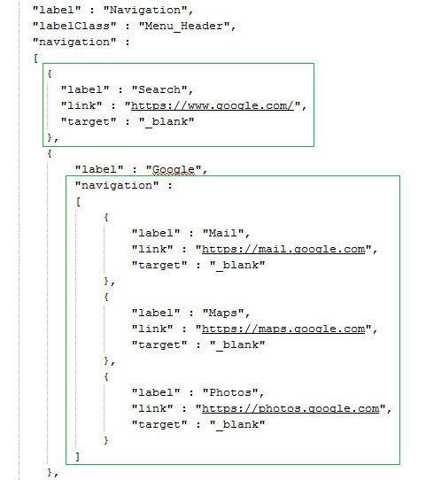
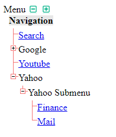

<h2>Objective</h2>
The basic idea is to create a Generic Tree Menu from a JSON File where all Menu and nested Sub menu items are described without touching the code
<h2>Folder/Components:</h2>
<ul>
<li><code>menu.html</code>: The main html page to be invoked from the Browser.</li>
<li><code>js/menu.js</code>: The Custom Javascript file containing logic to generate the Tree Menu using JQuery.</li>
<li><code>jquery/jquery.treeview.min.js</code>: JQuery add-on module for Tree view Menu.</li>
<li><code>jquery/jquery.treeview.css</code>: Style sheet used by JQuery add-on module for Tree view Menu.</li>
<li><code>css/menu.css</code>: Editable Custom Style sheet for Tree menu used by menu.html.</li>
<li><code>data/menu_data.json</code>: Editable JSON file containing Menu and Sub menu item details.</li>
<li><code>images/</code>: Folder containing all necessary images and icons.</li>
</ul>
<h2>Instructions</h2>
<ul>
<li>Clone/Copy the entire TreeMenuFromJSON folder and place it under any http/Web server.</li>
<li>Edit <code>data/menu_data.json</code> to add/update/delete following components:
<ul>
<li><code>label</code>: The menu item text appears on the screen (Mandatory)<li>
<li><code>link</code>: The hyper link associated with the label</li>
<li><code>target</code>: If specified as "_blank" the hyper link will be opened up on a new page/tab (Optional).</li>
<li><code>navigation</code>: Sub menu blocks. </li>
</ul>
</li>
<li>Enter <code>http(s)://&lt;host_server_fqdn&gt;:&lt;port&gt;/TreeMenuFromJSON/menu.html</code> on the Browser to display the menu.</li>
</ul>
<h2>Screenshots</h2>

